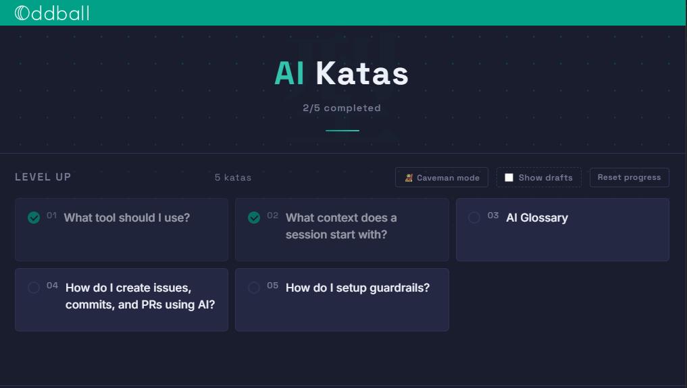

# AI Katas

Licensed under [CC BY 4.0](LICENSE). Share or adapt freely with attribution to Oddball.

Short, digestible topics about working with AI coding tools. Each kata is a quick read on one specific thing, paired with a small exercise you can try in your own setup.

Pick whatever looks interesting. Read it, try the exercise, move on.



## View the site

Clone the repo, then:

```bash
npx serve dist
```

Open http://localhost:3000/odd-ai-katas

That's it. No `npm install`, no dependencies. The pre-built static site is committed to `dist/`.

## For contributors

Run the dev server with hot reload:

```bash
npm install
npm run dev
```

Open http://localhost:4321/odd-ai-katas

Edits to existing MDX files hot-reload, but adding new `.mdx` files requires restarting the server (Astro's glob loader only scans at startup).

After making content changes, rebuild and commit `dist/` so readers see the latest:

```bash
npm run build
git add dist
git commit
```

## Deploy to GitHub Pages

A manual-only workflow lives at `.github/workflows/deploy.yml`. To deploy:

1. In repo settings, set **Settings > Pages** source to **GitHub Actions**.
2. Go to the **Actions** tab, pick **Deploy to GitHub Pages**, and click **Run workflow**.

To take it down, set the Pages source back to **None**.

The site publishes at `https://oddballteam.github.io/odd-ai-katas/`.

## Adding a kata

See `CLAUDE.md` for the kata authoring workflow, draft conventions, and how to graduate a draft to a finished kata.
